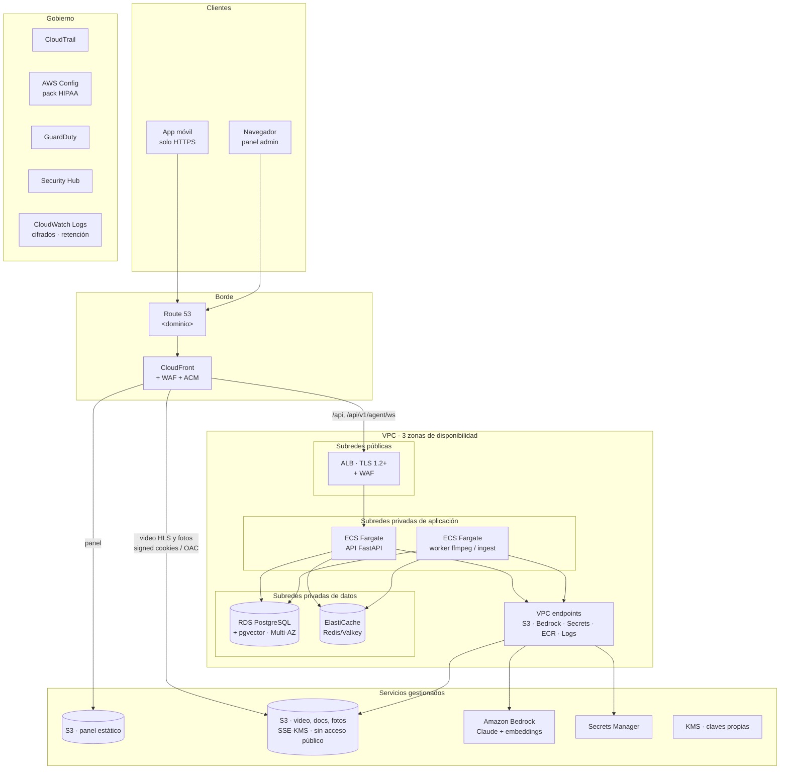

# Arquitectura en AWS con cumplimiento HIPAA

**Estado:** propuesta, pendiente de validar con compliance antes de escribir la infraestructura.
**Alcance:** llevar la plataforma (API, worker de video, panel y app móvil) de la demo actual en un
VPS a una cuenta AWS preparada para tratar PHI.

---

## 1. Punto de partida: qué significa "cumplir HIPAA" aquí

AWS **no** hace que una aplicación cumpla HIPAA. Lo que ofrece es:

1. Un **BAA** (Business Associate Addendum) que se acepta desde **AWS Artifact** y cubre la cuenta.
2. Una lista de servicios **HIPAA-eligible**. Solo esos pueden almacenar, procesar o transmitir PHI.

El resto es responsabilidad nuestra: configurar esos servicios de forma segura (modelo de
responsabilidad compartida), adaptar la aplicación y cumplir las salvaguardas administrativas
(análisis de riesgos, políticas, formación, respuesta a incidentes, notificación de brechas).

### ¿Hay PHI en esta plataforma?

Sí, aunque su propósito sea formar sobre equipos y no tratar pacientes:

| Dónde | Qué | Riesgo |
|---|---|---|
| `messages` / `conversations` | Texto libre del chat con el agente | **El principal.** El guardrail (D-006) impide que el agente dé consejo clínico, pero no impide que un técnico *escriba* datos de un paciente. Ese texto se guarda y se envía al LLM. |
| `users` | Nombre, email, institución, especialidad | Datos del personal, no de pacientes. No es PHI por sí mismo, pero identifica a quién escribió qué. |
| `user_lesson_progress`, `certificates`, `quiz_attempts` | Actividad formativa | Bajo. Se trata con el mismo nivel de protección por simplicidad. |
| Manuales, videos, fotos de producto | Contenido técnico | Sin PHI. Las fotos de producto pueden servirse públicamente (D-058). |

**Primera pregunta para compliance:** confirmar el rol de la organización (business associate de los
hospitales clientes, previsiblemente) y si se acepta el riesgo del texto libre o se añade detección
de PHI (ver §6.3).

---

## 2. Brechas de la demo actual

Estas brechas existen en cualquier entorno. Moverse a AWS sin corregirlas no aporta cumplimiento.

| # | Brecha | Salvaguarda HIPAA afectada | Dónde está |
|---|---|---|---|
| B1 | El chat y los embeddings se envían a **OpenAI**, y el catálogo de proveedores incluye Grok, DeepSeek y Google | Transmisión de PHI a terceros sin BAA | `agent/llm/registry.py`, `agent/llm/factory.py`, `agent/rag/ingest.py` |
| B2 | `AUTH_BYPASS_ENABLED=true`: `/auth/demo-login` entra sin credenciales (D-003) | Identificación única de usuario (§164.312(a)(2)(i)), autenticación (§164.312(d)) | `core/config.py`, `auth/router.py` |
| B3 | Todo el tráfico va en **HTTP plano**, JWT incluidos. La app declara `usesCleartextTraffic` | Seguridad en la transmisión (§164.312(e)) | `docker-compose.yml`, `AndroidManifest.xml` |
| B4 | Credenciales por defecto de Postgres y MinIO. Secretos y una API key real en `.env` | Control de acceso, gestión de secretos | `.env`, `docker-compose.yml` |
| B5 | No hay registro de auditoría de quién accede a qué conversación o dato | Controles de auditoría (§164.312(b)) | — (no existe) |
| B6 | Sesiones largas: access token de 60 min y refresh token de **14 días**, sin cierre por inactividad | Cierre automático de sesión (§164.312(a)(2)(iii)) | `core/config.py` |
| B7 | Sin MFA para el backoffice, que ve todas las conversaciones | Autenticación | `auth/` |
| B8 | Las tools HTTP del agente (D-007) pueden enviar el contenido de la conversación a hosts externos | Transmisión de PHI a terceros | `agent/tools/`, `TOOL_ALLOWED_HOSTS` |
| B9 | Sin backups automatizados ni plan de restauración probado | Plan de contingencia (§164.308(a)(7)) | — |
| B10 | Cifrado en reposo no garantizado: volúmenes Docker en el disco del VPS | Cifrado (§164.312(a)(2)(iv)) | `docker-compose.yml` |
| B11 | Dominio de deep links de ejemplo (`demoeca.example.com`, D-004) | — (funcional, pero bloquea TLS y App Links) | `DEEPLINK_DOMAIN` |

---

## 3. Arquitectura objetivo

Todos los servicios de este diagrama son HIPAA-eligible. En el diagrama `<dominio>` es un marcador:
se sustituye por el dominio real de la organización.

### 3.1 Correspondencia con el stack actual

| Hoy (VPS con Docker) | AWS | Notas |
|---|---|---|
| `pgvector/pgvector:pg16` | **RDS for PostgreSQL** con extensión `pgvector` | Multi-AZ, cifrado KMS, `rds.force_ssl=1`, backups automáticos con PITR, sin acceso público. El índice HNSW (`vector_cosine_ops`) está soportado. |
| `redis:7-alpine` | **ElastiCache** (Redis OSS o Valkey) | Cifrado en tránsito y en reposo, AUTH. Sigue siendo broker de Celery y rate limit. |
| MinIO, 3 buckets | **S3**, un bucket por propósito | SSE-KMS, versionado, *Block Public Access* activado a nivel de cuenta. |
| Bucket público de fotos (D-058) | S3 privado + **CloudFront con OAC** | Las fotos siguen siendo públicas *para el usuario final*, pero el bucket no. Mantiene el bloqueo de acceso público de cuenta, que Config suele exigir. |
| Proxy HLS firmado por FastAPI (D-011) | **CloudFront con signed cookies** | Es la "ruta de salida" que ya anticipaba D-011: los segmentos dejan de pasar por el API. |
| `backend` (uvicorn) | **ECS Fargate**, servicio API, detrás del **ALB** | Sin `--reload` ni bind mount del código. Imagen en **ECR** con escaneo. |
| `worker` (Celery + ffmpeg) | **ECS Fargate**, servicio worker | Colas `video` e `ingest` separadas como hoy (D-009). **MediaConvert** es alternativa futura, no necesaria para empezar. |
| `web` (nginx en `:80`, D-056) | **S3 + CloudFront** | CloudFront hace el papel del proxy de `/api` que hoy hace nginx: mismo origen, sin CORS. |
| OpenAI (chat + embeddings) | **Amazon Bedrock** | Acceso por rol IAM: desaparecen las API keys de proveedor y su cifrado Fernet (D-008). Ver §4. |
| `.env` | **Secrets Manager** + variables de la task definition | Rotación para la contraseña de RDS. |
| `SECRET_ENCRYPTION_KEY` (Fernet) | **KMS** | Deja de hacer falta para las credenciales LLM. Si se conservan tools HTTP con secretos, se cifran con KMS. |
| Logs de contenedor | **CloudWatch Logs** cifrados con KMS | Retención alineada con la política de compliance (habitualmente 6 años para documentación HIPAA; a confirmar). |
| — | **CloudTrail, Config (conformance pack HIPAA), GuardDuty, Security Hub, VPC Flow Logs** | Auditoría y detección a nivel de cuenta. |

### 3.2 Organización de cuentas

- **AWS Organizations** con cuentas separadas: `prod` (única con PHI), `staging` y `dev` (sin PHI, datos sintéticos como el seed actual), y una cuenta de `log-archive` a la que CloudTrail y Config envían sus registros de forma inmutable.
- El **BAA se acepta en AWS Artifact** para la cuenta de producción (o para toda la organización).
- Región en EE. UU. donde estén disponibles los modelos de Bedrock elegidos. Confirmar disponibilidad antes de fijarla.
- **SCP** (Service Control Policies) que impidan usar servicios no elegibles y regiones no aprobadas en `prod`.

---

## 4. IA: de OpenAI a Amazon Bedrock

**Decisión:** chat y embeddings sobre Amazon Bedrock. Queda cubierto por el mismo BAA de AWS, el
tráfico sale de la VPC por un endpoint privado y no hay claves de proveedor que gestionar.

### Consecuencias en el código

1. **Catálogo multi-LLM** (`agent/llm/registry.py`, `factory.py`): en producción se limita a
   modelos de Bedrock. Grok, DeepSeek, Google y OpenAI se retiran o se ocultan por configuración.
   El Agent Builder del panel sigue funcionando, con menos opciones.
2. **Embeddings** (`agent/rag/ingest.py`): pasan a Titan Text Embeddings o Cohere Embed en Bedrock.
   **Cambia la dimensión** (de 1536 con `text-embedding-3-small` a 1024) y, como fija D-005, eso
   invalida el corpus vectorizado:
   - migración Alembic que cambie `knowledge_chunks.embedding` a `vector(1024)` y reconstruya el
     índice HNSW;
   - re-vectorizado completo con `bootstrap_ai --force`;
   - volver a pasar `verify_guardrails` y **medir de nuevo el umbral `RAG_MAX_DISTANCE`**. El 0.65
     actual se calibró con los embeddings de OpenAI (D-015) y no es trasladable a otro modelo.
3. **Guardrail clínico** (D-006): el prompt base se conserva, pero hay que re-verificarlo con el
   modelo nuevo. Opcionalmente se añaden **Bedrock Guardrails** como segunda capa.
4. **Streaming por WebSocket**: Bedrock soporta respuesta en streaming, así que el contrato con la
   app (`start → sources → token → done`) no cambia.

---

## 5. Cambios necesarios en la aplicación

Independientes de la infraestructura, y **obligatorios** antes de meter un solo dato real.

| Brecha | Cambio | Ámbito |
|---|---|---|
| B2 | `AUTH_BYPASS_ENABLED=false` en todo entorno con PHI. El botón de acceso demo de la app pasa a login real. | Backend, app |
| B3 | TLS de extremo a extremo: ACM en CloudFront y ALB, `API_BASE_URL=https://api.<dominio>`, quitar `usesCleartextTraffic`, `MINIO_SECURE`/S3 siempre en HTTPS. | Infra, app |
| B11 | `DEEPLINK_DOMAIN=<dominio>`, y publicar `assetlinks.json` y `apple-app-site-association`. Resuelve de paso los App Links pendientes desde D-004. | Backend, app, CloudFront |
| B5 | **Módulo de auditoría**: tabla de solo inserción con quién, qué recurso, qué acción y cuándo, para lecturas y escrituras de conversaciones, usuarios y progreso. Se envía también a CloudWatch. Sin el contenido del mensaje en el log. | Backend |
| B6 | Access token de 15 min, refresh token de 12 h o menos, cierre por inactividad en app y panel, y revocación de refresh tokens al hacer logout. | Backend, app, panel |
| B7 | MFA obligatorio para roles de backoffice. **Amazon Cognito** es la opción natural si se quiere delegar identidad; la alternativa es TOTP propio. | Backend, panel |
| B8 | Tools HTTP desactivadas en producción, o `TOOL_ALLOWED_HOSTS` limitado a destinos con BAA. | Configuración |
| B4 | Ninguna credencial en variables planas: Secrets Manager, roles IAM por servicio (API y worker con permisos distintos) y mínimo privilegio sobre cada bucket. | Infra, backend |
| — | `storage.py` apunta a S3. El SDK de MinIO habla S3, pero conviene pasar a `boto3` para usar roles IAM en lugar de claves. | Backend |
| — | `hls.py` emite signed cookies de CloudFront en lugar de reescribir el `m3u8` con tokens propios (D-011). | Backend, app |
| — | Logs sin PHI: revisar que ni la API ni el worker registran cuerpos de mensajes, prompts o respuestas del LLM. | Backend |
| — | Retención y borrado: política de cuánto se conservan las conversaciones y un borrado efectivo, incluido el derecho de acceso del usuario a sus datos. | Backend, compliance |

---

## 6. Controles de seguridad por capa

### 6.1 Red
- VPC propia, subredes privadas para aplicación y datos. Solo el ALB y CloudFront son públicos.
- *Security groups* encadenados: ALB → API, API/worker → RDS y ElastiCache. Nada más.
- VPC endpoints para S3, Bedrock, Secrets Manager, ECR y CloudWatch Logs: el tráfico con PHI no sale por Internet.
- AWS WAF en CloudFront y ALB con reglas gestionadas y rate limiting.

### 6.2 Datos
- Cifrado en reposo con **claves KMS gestionadas por el cliente** en RDS, ElastiCache, S3, CloudWatch Logs y backups.
- Cifrado en tránsito obligatorio: TLS 1.2+ en CloudFront y ALB, `rds.force_ssl`, TLS en ElastiCache.
- Backups: RDS con PITR, S3 con versionado y *Object Lock* en el bucket de logs de auditoría. **Restauración probada** y documentada: sin prueba no hay plan de contingencia.

### 6.3 Detección de PHI en el chat (opcional, recomendado)
**Amazon Comprehend Medical** (`DetectPHI`, HIPAA-eligible) puede analizar cada mensaje antes de
guardarlo y enviarlo al LLM, para enmascarar identificadores de paciente o avisar al usuario. Reduce
el riesgo de B1 en su origen: el producto no necesita PHI para funcionar, así que lo mejor es no
tenerla. Añade latencia y coste por mensaje, así que es una decisión de producto y compliance.

### 6.4 Identidad y acceso
- IAM Identity Center para el equipo, sin usuarios IAM con claves de larga duración.
- MFA obligatorio en la consola. Acceso a producción por rol, con sesiones cortas y registrado en CloudTrail.
- Acceso de emergencia (*break-glass*) documentado.

### 6.5 Detección y auditoría
- CloudTrail de organización hacia `log-archive`, con validación de integridad.
- AWS Config con el **conformance pack "Operational Best Practices for HIPAA Security"**.
- GuardDuty y Security Hub activos, con alertas a un canal atendido.
- Auditoría de aplicación (§5, B5) además de la de infraestructura: CloudTrail no sabe qué conversación leyó un administrador.

---

## 7. Hoja de ruta

| Fase | Contenido | Quién | Criterio de salida |
|---|---|---|---|
| **0 · Organizativa** | Validar este documento con compliance. Análisis de riesgos. Cuenta y Organizations. **Aceptar el BAA en AWS Artifact.** Dominio en Route 53 o delegado. | Compliance, dirección | BAA firmado, riesgos documentados |
| **1 · Base de cuenta** | Organizations, SCP, Identity Center, CloudTrail, Config (pack HIPAA), GuardDuty, Security Hub, KMS. Todo como código (Terraform). | Plataforma | Config sin incumplimientos críticos en una cuenta vacía |
| **2 · Cambios de aplicación** | §4 y §5 completos, probados en local con `docker-compose` (que se mantiene para desarrollo). | Desarrollo | Smoke test, pytest, `verify_guardrails` y flujo móvil en verde con Bedrock, bypass desactivado y auditoría activa |
| **3 · Infraestructura** | VPC, RDS, ElastiCache, S3, CloudFront, ALB, ECS, ECR, Secrets Manager en `staging`. | Plataforma | Despliegue reproducible desde cero |
| **4 · Validación** | Pentest, prueba de restauración, revisión de logs sin PHI, APK con HTTPS y App Links. Repetir en `prod`. | Seguridad, QA | Informe de pentest sin hallazgos altos, restauración probada |
| **5 · Puesta en producción** | Carga del contenido real (manuales, videos, fotos). Runbooks de incidentes y de notificación de brechas. | Todos | Aprobación de compliance |

### Migración de datos
No hay nada que migrar desde la demo: sus usuarios son sintéticos y no contiene PHI. En AWS se parte
de cero con el seed, se re-vectorizan los manuales con Bedrock y se vuelven a subir los videos y las
fotos. Eso además evita arrastrar credenciales o datos de la demo a producción.

---

## 8. Lo que no cambia

- La arquitectura de la aplicación: FastAPI modular, Celery con dos colas, Angular y Flutter.
- La subida directa a almacenamiento con URL prefirmada (D-010), que S3 soporta igual.
- El modelo de datos, salvo la dimensión de los embeddings y la tabla de auditoría nueva.
- `docker-compose.yml` como entorno de desarrollo local, sin PHI.

---

## 9. Decisiones abiertas

| Decisión | Opciones | Recomendación |
|---|---|---|
| Rol HIPAA de la organización y alcance de PHI | Business associate / otro | Confirmar con compliance antes de nada |
| Detección de PHI en el chat | Comprehend Medical / aviso al usuario / nada | Comprehend Medical en modo enmascarado |
| Identidad | Cognito / auth propia con MFA | Cognito si se va a integrar SSO de hospitales; si no, auth propia con TOTP |
| Transcodificación | Worker ffmpeg en Fargate / MediaConvert | Fargate al inicio, por ser el código actual |
| Modelo de embeddings | Titan Text Embeddings / Cohere Embed | Medir ambos con `verify_guardrails` sobre los manuales reales antes de fijarlo (D-005) |
| Retención de conversaciones | Días / meses / años | Definida por compliance; condiciona backups y borrado |
| Herramienta de IaC | Terraform / CDK | Terraform |
