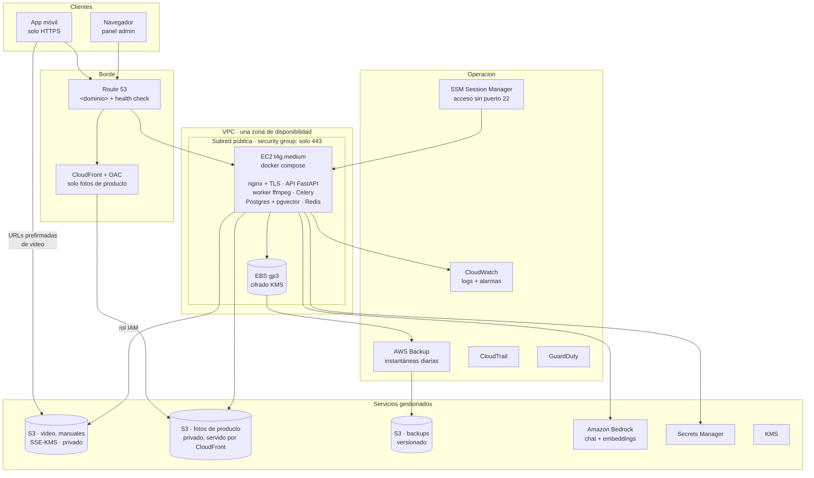

# Arquitectura en AWS con cumplimiento HIPAA

**Estado:** propuesta, pendiente de validar con compliance antes de escribir la infraestructura.
**Alcance:** llevar la plataforma (API, worker de video, panel y app móvil) de la demo actual en un
VPS a una cuenta AWS preparada para tratar PHI.
**Criterio rector:** cumplir HIPAA **al mínimo coste**, conservando todo lo que ya funciona.

> **Nota de revisión (octubre de 2026).** La primera versión de este documento proponía una
> arquitectura de gran empresa: Multi-AZ en tres zonas, ALB, NAT Gateway, ECS Fargate, RDS
> Multi-AZ, ElastiCache, cinco VPC endpoints por zona, Config y Security Hub. Costaba del orden de
> **400–800 USD al mes antes del primer usuario**, un orden de magnitud más que el servicio que
> sostiene. Con el volumen real confirmado por el cliente (§2) esa arquitectura está
> desproporcionada, así que **este documento la sustituye** por una instancia EC2 con el mismo
> `docker-compose.yml` de hoy. Lo descartado no se pierde: está en §9 como la ruta de crecimiento,
> por tramos y con el disparador de cada uno.

---

## 1. Punto de partida: qué significa "cumplir HIPAA" aquí

AWS **no** hace que una aplicación cumpla HIPAA. Lo que ofrece es:

1. Un **BAA** (Business Associate Addendum) que se acepta desde **AWS Artifact** y cubre la cuenta.
2. Una lista de servicios **HIPAA-eligible**. Solo esos pueden almacenar, procesar o transmitir PHI.

El resto es responsabilidad nuestra: configurar esos servicios de forma segura (modelo de
responsabilidad compartida), adaptar la aplicación y cumplir las salvaguardas administrativas
(análisis de riesgos, políticas, formación, respuesta a incidentes, notificación de brechas).

**Lo que HIPAA no exige, y conviene decirlo pronto porque es de donde sale el ahorro:** no exige
alta disponibilidad, ni Multi-AZ, ni servicios gestionados, ni contenedores sin servidor. Exige
servicios cubiertos por el BAA, cifrado en reposo y en tránsito, control de acceso, auditoría y un
**plan de contingencia con la restauración probada**. Una sola EC2 cumple todo eso. AWS dejó de
exigir instancias dedicadas para cargas con PHI en 2017.

### ¿Hay PHI en esta plataforma?

Sí, aunque su propósito sea formar sobre equipos y no tratar pacientes:

| Dónde | Qué | Riesgo |
|---|---|---|
| `messages` / `conversations` | Texto libre del chat con el agente | **El principal.** El guardrail (D-006) impide que el agente dé consejo clínico, pero no impide que un técnico *escriba* datos de un paciente. Ese texto se guarda y se envía al LLM. |
| `users` | Nombre, email, institución, especialidad | Datos del personal, no de pacientes. No es PHI por sí mismo, pero identifica a quién escribió qué. |
| `user_lesson_progress`, `certificates`, `quiz_attempts` | Actividad formativa | Bajo. Se trata con el mismo nivel de protección por simplicidad. |
| Manuales, videos, fotos de producto | Contenido técnico | Sin PHI. Las fotos de producto pueden servirse públicamente (D-058). |

**Primera pregunta para compliance:** confirmar el rol de la organización (business associate de los
hospitales clientes, previsiblemente) y si se acepta el riesgo del texto libre o se añade detección
de PHI (ver §7.3).

---

## 2. Dimensionamiento real

Datos confirmados por el cliente, y son los que justifican toda la arquitectura que sigue:

| Parámetro | Valor |
|---|---|
| Usuarios | ~200 personas al mes |
| Equipos | 10 máquinas, con margen para crecer |
| Visibilidad del catálogo | **Abierto a todos.** No hay separación por cliente ni multi-tenancy; D-001 sigue vigente |
| Progreso | Se registra **por usuario**, y es un requisito explícito |
| Dominio propio para HTTPS | Sí, disponible |
| Alta disponibilidad | **No es prioritaria.** Se acepta levantar el servicio manualmente si cae, siempre que no ocurra a menudo ni dure mucho |
| Monitorización | Requisito: hay que enterarse de una caída sin que la reporte un usuario |

Tráfico de video estimado: ~200 personas × ~1 hora a 720p ≈ **140 GB al mes**. AWS incluye 100 GB
de salida gratis al mes, así que el exceso son unos 4 USD.

---

## 3. Brechas de la demo actual

Estas brechas existen en cualquier entorno. Moverse a AWS sin corregirlas no aporta cumplimiento.

| # | Brecha | Salvaguarda HIPAA afectada | Dónde está |
|---|---|---|---|
| B1 | El chat y los embeddings se envían a **OpenAI**, y el catálogo de proveedores incluye Grok, DeepSeek y Google | Transmisión de PHI a terceros sin BAA | `agent/llm/registry.py`, `agent/llm/factory.py`, `agent/rag/ingest.py` |
| B2 | `AUTH_BYPASS_ENABLED=true`: `/auth/demo-login` entra sin credenciales (D-003) | Identificación única de usuario (§164.312(a)(2)(i)), autenticación (§164.312(d)) | `core/config.py`, `auth/router.py` |
| B3 | Todo el tráfico va en **HTTP plano**, JWT incluidos. La app declara `usesCleartextTraffic` | Seguridad en la transmisión (§164.312(e)) | `docker-compose.yml`, `AndroidManifest.xml` |
| B4 | Credenciales por defecto de Postgres y MinIO. Secretos y una API key real en `.env` | Control de acceso, gestión de secretos | `.env`, `docker-compose.yml` |
| B5 | No hay registro de auditoría de quién accede a qué conversación o dato | Controles de auditoría (§164.312(b)) | — (no existe) |
| B6 | Sesiones largas: access token de 60 min y refresh token de **14 días**, sin cierre por inactividad | Cierre automático de sesión (§164.312(a)(2)(iii)) | `core/config.py` |
| B7 | Sin MFA para el backoffice, que ve todas las conversaciones | Autenticación | `auth/` |
| B8 | Las tools HTTP del agente (D-007) pueden enviar el contenido de la conversación a hosts externos | Transmisión de PHI a terceros | `agent/tools/`, `TOOL_ALLOWED_HOSTS` |
| B9 | Sin backups automatizados ni plan de restauración probado | Plan de contingencia (§164.308(a)(7)) | — |
| B10 | Cifrado en reposo no garantizado: volúmenes Docker en el disco del VPS | Cifrado (§164.312(a)(2)(iv)) | `docker-compose.yml` |
| B11 | Dominio de deep links de ejemplo (`demoeca.example.com`, D-004) | — (funcional, pero bloquea TLS y App Links) | `DEEPLINK_DOMAIN` |

**B2 tiene además una consecuencia de producto, no solo de cumplimiento:** hoy todo el mundo entra
con el mismo usuario demo compartido, así que el progreso de las 200 personas se acumularía sobre
una sola cuenta. El login real es lo que hace posible el requisito de registrar el progreso por
usuario, así que encabeza el orden de trabajo (§6).

---

## 4. Arquitectura objetivo

Todos los servicios son HIPAA-eligible. `<dominio>` es el dominio real del cliente.

### 4.1 Correspondencia con el stack actual

| Hoy (VPS con Docker) | En AWS | ¿Cambia el código? |
|---|---|---|
| `docker-compose.yml` completo | **Igual**, en una EC2 | No |
| `pgvector/pgvector:pg16` | **Igual, en contenedor**, sobre EBS cifrado con KMS, con instantánea diaria y volcado `pg_dump` a S3 | No |
| `redis:7-alpine` | **Igual, en contenedor** | No |
| `web` (nginx en el :80, D-056) | **Igual**, más TLS con un certificado de Let's Encrypt renovado automáticamente | Configuración de nginx |
| Proxy de HLS con 307 a URL prefirmada (D-011) | **Igual**, firmando contra S3 | No |
| Subida directa con URL prefirmada (D-010) | **Igual**: S3 soporta el mismo mecanismo | No |
| MinIO, 3 buckets | **S3**, un bucket por propósito, SSE-KMS, *Block Public Access* a nivel de cuenta | Mínimo: el SDK de MinIO habla S3. Conviene pasar a credenciales por **rol IAM** de la instancia en lugar de claves |
| Bucket público de fotos (D-058) | S3 privado + **CloudFront con OAC** | Composición de la URL pública |
| OpenAI (chat + embeddings) | **Amazon Bedrock** por rol IAM | Sí, ver §5 |
| `.env` con secretos | **Secrets Manager**, leído al arrancar | Despliegue |
| `SECRET_ENCRYPTION_KEY` (Fernet) | **KMS** para lo que quede. Con Bedrock desaparecen las API keys de proveedor y su cifrado (D-008) | Parcial |
| SSH con root y puerto 22 abierto | **SSM Session Manager**, sin puerto 22 | No |
| Puerto 9000 de MinIO público a la fuerza | **Desaparece**: las URLs prefirmadas apuntan a S3 por HTTPS | No |
| Logs de contenedor | **CloudWatch Logs** cifrados, con retención según la política de compliance | Driver de logs |
| — | **CloudTrail** (primer trail gratis) y **GuardDuty** | No |

**Superficie de red.** Un solo security group: 443 abierto, 80 solo para la redirección y el
desafío de ACME, y nada más. Sin NAT Gateway (la instancia está en subred pública con IP elástica)
y sin VPC endpoints: son ~32 y ~7–8 USD al mes cada uno y no aportan cumplimiento aquí, porque el
tráfico a S3 y Bedrock va cifrado con TLS por el camino de AWS. Los puertos de Postgres, Redis y la
consola de administración siguen atados a `127.0.0.1` dentro de la instancia, como ya hace el
compose (D-056).

### 4.2 Cuenta y gobierno

Una **sola cuenta de AWS** para producción, y el desarrollo sigue en local con `docker-compose`, que
no contiene PHI. No hace falta AWS Organizations con varias cuentas para un servicio de este tamaño;
se añade si aparece un entorno de staging con datos reales.

- **BAA aceptado en AWS Artifact** para la cuenta. Es gratis y es el primer paso de todos.
- **IAM Identity Center** con MFA obligatorio en consola, sin usuarios IAM con claves de larga
  duración. Un rol para la instancia, con permiso solo sobre sus buckets y los modelos de Bedrock
  que use.
- **CloudTrail** con un trail hacia un bucket versionado, y **GuardDuty** activo con aviso por
  email.
- Región de EE. UU. donde estén disponibles los modelos de Bedrock elegidos. Confirmar antes de
  fijarla.
- AWS Config con el conformance pack de HIPAA y Security Hub quedan **fuera por ahora**: cobran por
  evaluación y por comprobación, y sus hallazgos aplican sobre todo a arquitecturas con muchos
  recursos. Se revisan cuando crezca la infraestructura (§9).

### 4.3 Monitorización y recuperación

La alta disponibilidad no es el objetivo; enterarse y recuperar rápido, sí.

| Capa | Qué resuelve | Coste aprox. |
|---|---|---|
| **Auto-recover de EC2** (alarma sobre `StatusCheckFailed_System`) | Fallo del hardware de AWS: la instancia se reinicia en otro host con la misma IP elástica y los mismos discos, sin intervención | Gratis |
| **`restart: unless-stopped`** en el compose | Un contenedor que muere vuelve solo | Gratis |
| **Health check de Route 53** sobre `https://<dominio>/health` → SNS | La API deja de responder: aviso por email o SMS en 1–2 minutos | ~1 USD/mes |
| **CloudWatch Agent** con alarmas de disco y memoria al 85 % | La causa más común de caída en un servidor único, y avisa **antes** de caer | ~2–3 USD/mes |
| **AWS Backup**: instantánea diaria del EBS, más `pg_dump` diario a S3 versionado | Pérdida total de la instancia: se reconstruye en < 1 hora | ~5 USD/mes |

**La restauración se prueba y se documenta como runbook.** Sin una prueba de restauración no hay
plan de contingencia a efectos de §164.308(a)(7), y una instantánea que nadie ha restaurado nunca no
es una copia de seguridad. Objetivos propuestos, a confirmar con el cliente: **RPO de 24 horas** (se
puede perder como mucho un día de progreso y conversaciones) y **RTO de 1 hora**.

### 4.4 Coste estimado

Aproximado, región de EE. UU., **a confirmar con la calculadora de AWS** antes de comprometerlo.

| Partida | USD/mes |
|---|---|
| EC2 t4g.medium (2 vCPU, 4 GB, ARM) | ~25 (≈15 con compromiso de 1 año) |
| EBS gp3 50 GB cifrado | ~4 |
| IP elástica | ~4 |
| AWS Backup y S3 de backups | ~5 |
| Route 53 (zona + health check) | ~2 |
| CloudWatch (logs y métricas del agente) | ~3 |
| GuardDuty | ~3 |
| S3 de contenido y salida de datos sobre los 100 GB gratis | ~5 |
| CloudFront (fotos de producto) | 0 — entra en el nivel gratuito |
| Secrets Manager, KMS, CloudTrail, SSM | ~3 |
| **Total infraestructura** | **~45–60** |
| Amazon Bedrock | Por consumo: a este volumen, unos pocos dólares |

**Instancia:** t4g.medium es ARM (Graviton), la opción más barata por rendimiento. Hay que verificar
que todas las imágenes del compose tengan variante `arm64`; si alguna no la tiene, la alternativa
equivalente en x86 es t3a.medium, por ~27 USD. El APK **no se compila en el servidor**: la imagen de
Flutter y Gradle piden más memoria que la instancia, y ya hay scripts para compilarlo en la máquina
de desarrollo (D-037).

---

## 5. IA: de OpenAI a Amazon Bedrock

**Decisión:** chat y embeddings sobre Amazon Bedrock. Queda cubierto por el mismo BAA de AWS, se
accede con el rol IAM de la instancia y no hay claves de proveedor que gestionar ni cifrar.

### Consecuencias en el código

1. **Catálogo multi-LLM** (`agent/llm/registry.py`, `factory.py`): en producción se limita a modelos
   de Bedrock. Hace falta añadir `langchain-aws` a las dependencias. OpenAI, Grok, DeepSeek y Google
   se retiran o se ocultan por configuración. El Agent Builder del panel sigue funcionando, con
   menos opciones.
2. **Embeddings** (`agent/rag/ingest.py`): pasan a Titan Text Embeddings o Cohere Embed. **Cambia la
   dimensión** (de 1536 con `text-embedding-3-small` a 1024) y, como fija D-005, eso invalida el
   corpus vectorizado:
   - migración Alembic que cambie `knowledge_chunks.embedding` a `vector(1024)` y reconstruya el
     índice HNSW;
   - re-vectorizado completo con `bootstrap_ai --force`;
   - volver a pasar `verify_guardrails` y **medir de nuevo el umbral `RAG_MAX_DISTANCE`**. El 0.65
     actual se calibró con los embeddings de OpenAI (D-015) y no es trasladable a otro modelo.
3. **Guardrail clínico** (D-006): el prompt base se conserva, pero hay que re-verificarlo con el
   modelo nuevo. Opcionalmente se añaden **Bedrock Guardrails** como segunda capa.
4. **Streaming por WebSocket**: Bedrock soporta respuesta en streaming, así que el contrato con la
   app (`start → sources → token → done`) no cambia.
5. **Modelo de chat:** empezar por el Claude más barato que supere `verify_guardrails` con calidad
   suficiente. El coste por conversación a este volumen es marginal, así que la elección la decide
   la calidad de las respuestas, no el precio.

---

## 6. Cambios necesarios en la aplicación

Independientes de la infraestructura, y **obligatorios** antes de meter un solo dato real. El orden
es el de trabajo: el primero desbloquea un requisito de producto, no solo de cumplimiento.

| # | Brecha | Cambio | Ámbito |
|---|---|---|---|
| 1 | B2 | **Login real y `AUTH_BYPASS_ENABLED=false`.** El botón de acceso demo de la app pasa a login. Sin esto el progreso de las 200 personas se acumula sobre la cuenta demo compartida | Backend, app |
| 2 | — | **Pantalla de progreso por usuario en el panel.** El dato ya está en `user_lesson_progress`; faltan el endpoint y la UI. Hoy el panel solo muestra totales y no tiene pantalla de usuarios. Es además la base de los exámenes y certificados cuando se retomen | Backend, panel |
| 3 | B5 | **Módulo de auditoría**: tabla de solo inserción con quién, qué recurso, qué acción y cuándo, para lecturas y escrituras de conversaciones, usuarios y progreso. Se envía también a CloudWatch. **Sin el contenido del mensaje en el log** | Backend |
| 4 | B6 | Access token de 15 min, refresh token de 12 h o menos, cierre por inactividad en app y panel, y revocación de refresh tokens al cerrar sesión | Backend, app, panel |
| 5 | B7 | **MFA con TOTP** para los roles de backoffice. Se descarta Cognito: añade coste e integración para un backoffice de dos o tres cuentas | Backend, panel |
| 6 | B3 | TLS de extremo a extremo: certificado en nginx, `API_BASE_URL=https://api.<dominio>`, quitar `usesCleartextTraffic`, S3 siempre por HTTPS | Infra, app |
| 7 | B11 | `DEEPLINK_DOMAIN=<dominio>`, y publicar `assetlinks.json` y `apple-app-site-association`. Resuelve de paso los App Links pendientes | Backend, app |
| 8 | B8 | Tools HTTP desactivadas en producción, o `TOOL_ALLOWED_HOSTS` limitado a destinos con BAA | Configuración |
| 9 | B4 | Ninguna credencial en variables planas: Secrets Manager y rol IAM con mínimo privilegio sobre cada bucket | Infra, backend |
| 10 | — | `storage.py` apunta a S3 con credenciales del rol de la instancia | Backend |
| 11 | — | Logs sin PHI: revisar que ni la API ni el worker registran cuerpos de mensajes, prompts o respuestas del LLM | Backend |
| 12 | — | Retención y borrado: política de cuánto se conservan las conversaciones, borrado efectivo y derecho de acceso del usuario a sus datos | Backend, compliance |

**Lo que no cambia:** el proxy de HLS (D-011) se queda tal cual. Su límite conocido es que no
escala a cientos de usuarios concurrentes, y con 200 al mes eso no va a pasar. Pasar a CloudFront
con signed cookies queda en §9.

---

## 7. Controles de seguridad por capa

### 7.1 Red
- VPC propia, una zona. La instancia en subred pública con IP elástica, sin NAT Gateway.
- Un security group: 443 desde Internet, 80 solo para redirección y renovación del certificado.
  Nada más abierto.
- Acceso de administración por **SSM Session Manager**: sin puerto 22, sin claves SSH que rotar, y
  cada sesión queda registrada en CloudTrail.
- Postgres, Redis y la consola de administración solo en `127.0.0.1` dentro de la instancia.

### 7.2 Datos
- Cifrado en reposo con **KMS** en EBS, S3, backups y CloudWatch Logs.
- Cifrado en tránsito: TLS en nginx, HTTPS hacia S3 y Bedrock, y TLS entre la app y la API.
- Postgres y Redis hablan por la red interna de Docker, que no sale de la instancia.
- Backups: instantánea diaria del EBS más `pg_dump` a S3 versionado, con **restauración probada**
  (§4.3).

### 7.3 Detección de PHI en el chat (opcional, recomendado)
**Amazon Comprehend Medical** (`DetectPHI`, HIPAA-eligible) puede analizar cada mensaje antes de
guardarlo y enviarlo al LLM, para enmascarar identificadores de paciente o avisar al usuario. Reduce
el riesgo de B1 en su origen: el producto no necesita PHI para funcionar, así que lo mejor es no
tenerla. Añade latencia y coste por mensaje, así que es una decisión de producto y compliance.

### 7.4 Identidad y acceso
- IAM Identity Center para el equipo, MFA obligatorio en consola, sin claves de larga duración.
- Un rol para la instancia con permiso solo sobre sus buckets y sus modelos de Bedrock.
- Acceso de emergencia (*break-glass*) documentado.

### 7.5 Auditoría
- **CloudTrail** hacia un bucket versionado, con validación de integridad.
- **GuardDuty** con aviso a un canal atendido.
- **Auditoría de aplicación** (§6, punto 3) además de la de infraestructura: CloudTrail no sabe qué
  conversación leyó un administrador.

---

## 8. Hoja de ruta

| Fase | Contenido | Quién | Criterio de salida |
|---|---|---|---|
| **0 · Organizativa** | Validar este documento con compliance. Análisis de riesgos. Crear la cuenta. **Aceptar el BAA en AWS Artifact.** Dominio en Route 53 o delegado | Compliance, dirección | BAA firmado, riesgos documentados |
| **1 · Cambios de aplicación** | §5 y §6 completos, probados en local con `docker-compose` | Desarrollo | Smoke test, pytest, `verify_guardrails` y flujo móvil en verde con Bedrock, bypass desactivado, auditoría activa y progreso por usuario visible en el panel |
| **2 · Infraestructura** | Cuenta, IAM, VPC, EC2, EBS cifrado, buckets S3, Secrets Manager, CloudFront, TLS, SSM, CloudWatch, backups. Todo como código (Terraform) | Plataforma | Despliegue reproducible desde cero |
| **3 · Validación** | Prueba de restauración completa, revisión de logs sin PHI, APK con HTTPS y App Links, repaso de los puertos expuestos | Seguridad, QA | Restauración probada y cronometrada, sin hallazgos altos |
| **4 · Puesta en producción** | Carga del contenido real (manuales, videos, fotos), re-vectorizado con Bedrock, runbooks de incidentes y de notificación de brechas | Todos | Aprobación de compliance |

### Migración de datos
No hay nada que migrar desde la demo: sus usuarios son sintéticos y no contiene PHI. En AWS se parte
de cero con el seed, se re-vectorizan los manuales con Bedrock y se vuelven a subir los videos y las
fotos. Eso además evita arrastrar credenciales o datos de la demo a producción. **Conviene revocar
la API key de OpenAI del `.env` del servidor actual** en cuanto Bedrock esté en marcha.

---

## 9. Ruta de crecimiento

Nada de lo anterior impide crecer, y cada tramo tiene su disparador. El orden es el de la mejor
relación entre lo que resuelve y lo que cuesta.

| Disparador | Cambio | Coste adicional aprox. |
|---|---|---|
| La operación de la base de datos pesa, o se quiere PITR en lugar de copias diarias | **RDS PostgreSQL** single-AZ (db.t4g.micro) con pgvector. Baja el RPO a minutos y quita trabajo de encima | ~15 USD/mes |
| El tráfico de video supera unos cientos de GB al mes, o el proxy de HLS empieza a notarse | **CloudFront con signed cookies** para el video. Es la ruta de salida que ya anticipaba D-011 | Variable, con 1 TB/mes gratis |
| Una caída de una hora deja de ser aceptable | **ALB + segunda instancia** y RDS Multi-AZ | ~150 USD/mes |
| Crecen los despliegues o entra un equipo de plataforma | **ECS Fargate** para API y worker, imágenes en ECR | ~60 USD/mes y más |
| Varios entornos con datos reales, o auditoría externa | **AWS Organizations**, cuenta de log-archive, **Config** con el pack de HIPAA, **Security Hub**, SCP por región y servicio | ~50–150 USD/mes |
| Hospitales que piden entrar con sus cuentas corporativas | **Cognito** con SSO federado | Variable |

---

## 10. Lo que no cambia

- La arquitectura de la aplicación: FastAPI modular, Celery con dos colas, Angular y Flutter.
- La subida directa a almacenamiento con URL prefirmada (D-010), que S3 soporta igual.
- El proxy de HLS con redirección 307 (D-011), hasta que el volumen de video lo justifique.
- El modelo de datos, salvo la dimensión de los embeddings y las tablas nuevas de auditoría.
- `docker-compose.yml` como entorno de desarrollo local, sin PHI, y como el runtime del servidor.

---

## 11. Decisiones abiertas

| Decisión | Opciones | Recomendación |
|---|---|---|
| Rol HIPAA de la organización y alcance de PHI | Business associate / otro | Confirmar con compliance antes de nada |
| **Cómo se crean las cuentas de los técnicos** | Las crea el admin desde el panel / registro propio con verificación por email (exige SES) / SSO del hospital (exige Cognito) | Las crea el admin, con carga masiva por CSV si hace falta. Es lo más barato y lo más controlado. **Bloquea el diseño del login** |
| Alcance del MFA | Solo backoffice / todos | Solo backoffice: es la cuenta que ve los datos de todos, y añadir un segundo factor en el móvil molesta a quien trabaja de pie y con guantes |
| Detección de PHI en el chat | Comprehend Medical / aviso al usuario / nada | Comprehend Medical en modo enmascarado, si el coste por mensaje se acepta |
| Modelo de embeddings | Titan Text Embeddings / Cohere Embed | Medir ambos con `verify_guardrails` sobre los manuales reales antes de fijarlo (D-005) |
| Arquitectura de la instancia | t4g.medium (ARM) / t3a.medium (x86) | ARM, tras verificar que todas las imágenes del compose tienen variante `arm64` |
| RPO y RTO | 24 h / 1 h propuestos | Confirmar con el cliente: define la frecuencia de las copias |
| Retención de conversaciones | Días / meses / años | La define compliance; condiciona backups y borrado |
| Herramienta de IaC | Terraform / CDK | Terraform |
